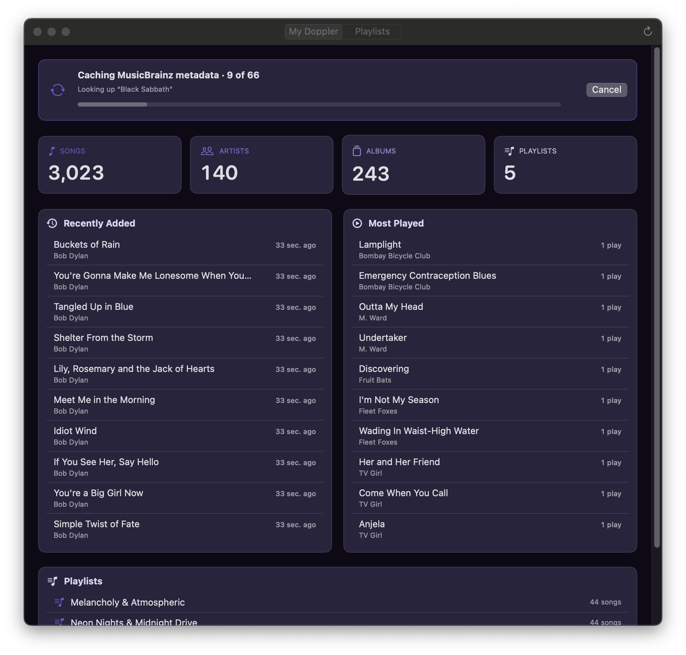
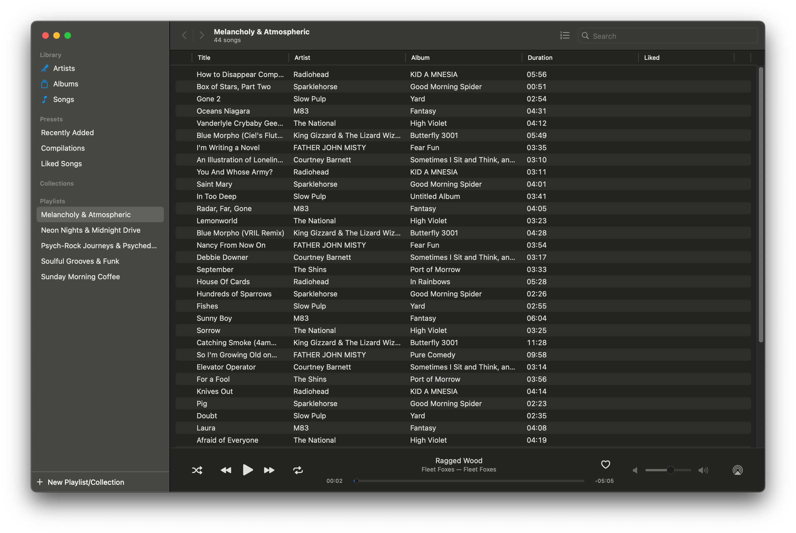
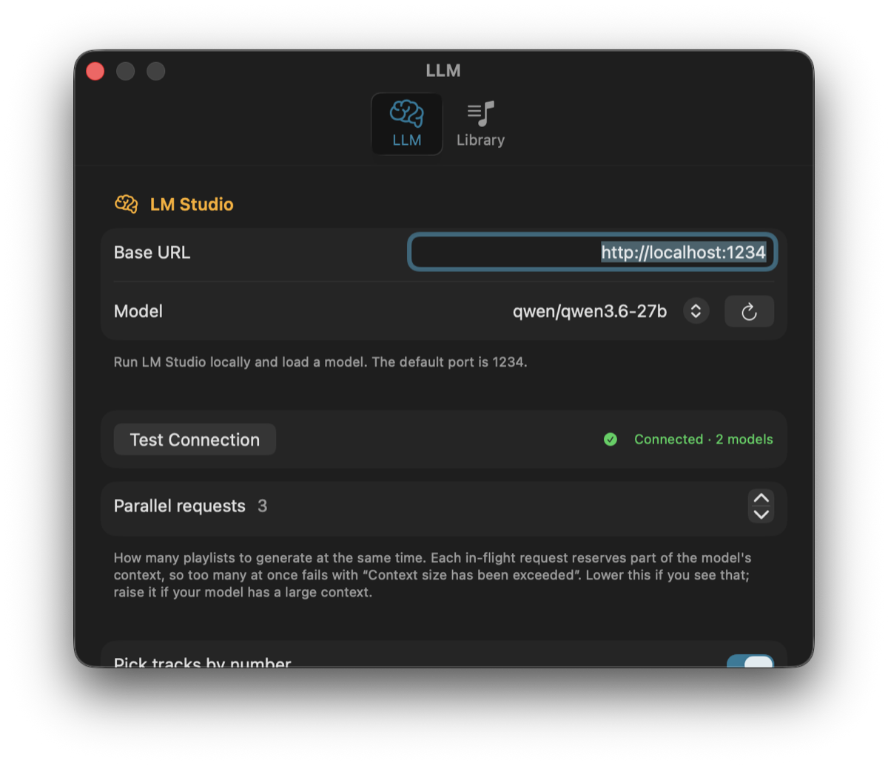

# MixTape

A macOS app that uses a **local LLM** to generate themed playlists from your [Doppler](https://brushedtype.co/doppler/) music library, then writes them back into Doppler so they sit next to your hand-curated ones.

Everything runs on your machine. Your library never leaves it — the only network calls are to your own [LM Studio](https://lmstudio.ai) server, and to MusicBrainz and ListenBrainz to look up artist genre tags and match your tracks. Neither service is told who you are.

[**Overview and screenshots**](https://rischio.studio/MixTape/) · [**Download**](https://github.com/studio-rischio/MixTape/releases/latest)

> Built with heavy use of [Claude Code](https://claude.com/claude-code), Anthropic's AI coding assistant; contributed commits are tagged as such in the git history, and the brief it works from is checked into the repo as [CLAUDE.md](CLAUDE.md). Architecture, the model and context constraints, and what ships are human decisions, and since there is no automated test suite, every release is verified by hand against a real Doppler library.



---

# For users

## What it does

- Reads your Doppler library directly and shows you what's in it — counts, recently added, most played, existing playlists.
- Looks up every artist on [MusicBrainz](https://musicbrainz.org/doc/MusicBrainz_API) once to learn their genre tags, and matches your tracks against [ListenBrainz](https://listenbrainz.org) for how widely played they are. Both are cached locally and only fetched once.
- Asks your local model for themed playlist concepts, then fills each one with **tracks you actually own** — the model only ever picks from a list of your real song titles, so it can't invent music you don't have.
- Writes a finished playlist into Doppler as a native playlist, or exports it as a `.m3u` for any other player.

A generated playlist, after **Add to Doppler**, sitting in Doppler's own sidebar:



## Requirements

- **macOS 15.7 or later** (Apple Silicon)
- **[Doppler for macOS](https://brushedtype.co/doppler/)** installed, with at least one song in its library
- **[LM Studio](https://lmstudio.ai)** running locally with a chat model loaded. Tested with **qwen3.6-27b on an M3 Ultra** — other models and Apple Silicon Macs should be fine, that's simply the combination it was developed and measured against.
  - **Set the model's context length to ≥ 8 K** (16 K recommended). The per-theme prompts include your real song titles and won't fit in a 4 K window.
- **Xcode 26 or later**, but only if you're [building from source](#building-from-source) rather than using the download. The project uses an Icon Composer app icon and Xcode 26 build settings, so earlier versions won't open it. Xcode 26 itself runs on macOS 15.6+, so you don't need to upgrade past Sequoia to build.

## Installing

[**Download the latest release**](https://github.com/studio-rischio/MixTape/releases/latest), unzip it, and drag **MixTape.app** to `/Applications`. Apple Silicon only.

Because the app is ad-hoc signed rather than notarized, macOS Gatekeeper will block the first launch. Right-click the app and choose *Open*, then confirm — you only do this once.

### Building from source

Clone the repo and build it:

```sh
git clone https://github.com/studio-rischio/MixTape.git
cd MixTape
./build.sh
```

That produces (and opens) `build/Build/Products/Release/MixTape.app`. Drag it to `/Applications` if you want to keep it.

Or open `MixTape.xcodeproj` in Xcode and hit ⌘R.

> **Signing:** no configuration needed. The project ships without a development team, so macOS signs the app ad-hoc ("Sign to Run Locally") and the sandbox entitlements still apply. If you want a real signature — to notarize it, say — open the project in Xcode, go to *Signing & Capabilities*, and pick your own team.

## First run

The **Settings** window opens automatically the first time. Set up two things:

1. **LLM tab** — confirm the LM Studio base URL (default `http://localhost:1234`), pick your loaded model from the list, and hit *Test Connection*.
2. **Library tab** — *Choose Library…* and select your `Library.dopplerdb` bundle. It normally lives in `~/Library/Application Support/Doppler/`. The picker opens there for you, with hidden files shown so you can navigate into `~/Library`.



Then switch to **My Library**. The app immediately starts caching artist metadata from MusicBrainz. This takes roughly **1 second per artist** — MusicBrainz rate-limits anonymous users, and the app respects that. A 140-artist library takes a couple of minutes. It only happens once; the results are cached on disk.

The **Discover** and **Create** tabs unlock when that finishes.

## Discovering playlists

1. Go to **Discover**, choose how many playlists you want (1–20, default 9), roughly how many tracks each should have (10–150, default 45), and how well-known those tracks should be — **Hits**, **Balanced** or **Deep cuts** — then hit **Generate**.
2. Themes appear first, then each playlist fills in independently as the model works through them — you don't have to wait for all of them.
3. Click any tile to open its tracklist. From there:
   - **Add to Doppler** — writes it into your library as a real Doppler playlist. **Quit Doppler first** (see below). Relaunch Doppler and it's there.
   - **Save .m3u** — writes a standard playlist file into a folder of your choosing, in one click. Paths are relative to your music folder, so it plays in any player. You're asked for the folder the first time only; after that it's a single click. The button's menu holds **Export .m3u…** if you'd rather pick a location each time, and lets you change or reveal the save folder.
   - **Retry** — if one playlist failed (the model returned something unparseable, say), this regenerates just that one, without touching the others.

By default the model picks tracks by number from a list of songs you own, so every track it returns is one you actually have. If it returns a number that isn't on the list, or repeats one, that pick is discarded and the sheet notes how many were dropped.

You can turn this off in **Settings → LLM → Pick tracks by number**, which switches to having the model type out titles and artists instead. That's slower and more expensive, and tracks it names but the app can't find in your library are shown struck through and skipped on both write and export. Worth trying if your model handles numbered lists badly.

## Creating a playlist from a description

**Discover** decides the themes for you. **Create** is the other way round: you describe an occasion, mood or activity and it builds one playlist for it from music you own.

1. Go to **Create** and type something like *Italian dinner night*, *long biking trip* or *rainy Sunday morning*. Press Return.
2. It picks the artists from your library that suit the request, names the playlist, then fills it with tracks — the same two passes **Discover** uses.
3. The result appears as a tile. Click it for the tracklist, **Add to Doppler** and **Save .m3u**, exactly as in Discover.

The track-count and familiarity controls sit above the box and apply here too. Requests are interpreted by feel rather than literally — *Italian dinner night* means warm, unhurried, convivial, not necessarily Italian artists. Results stack up newest-first, so you can try a few phrasings and compare before adding one.

## Building a playlist from one track you like

The **Create** tab's second mode, **More like this**, doesn't use the LLM at all — it works with LM Studio closed.

1. Switch to **More like this** and search your library for a track.
2. Click it. You'll get songs you own that other listeners play alongside it, with the seed track first.

This uses real listening data from [ListenBrainz](https://listenbrainz.org) rather than a model's opinion. Because it's built from what people actually play, coverage is uneven: well-known tracks work well, while lesser-known artists may have no listening data at all, and you'll be told so rather than handed a bad playlist.

## Things to know

- **Quit Doppler before *Add to Doppler*.** The app refuses to write while Doppler is running, and tells you why: Doppler holds the database open and would overwrite the change when it quits. Saving or exporting an `.m3u` is read-only and works either way.
- **There's no automatic backup.** The write is wrapped in a single transaction, so you'll never get half a playlist — but if you want to be careful, copy `~/Library/Application Support/Doppler/Library.dopplerdb` somewhere safe first.
- **Generated playlists don't survive quitting.** They live in memory until you add or export them. Anything already written into Doppler is a normal Doppler playlist and persists normally.
- **The app only ever reads your library** until the moment you press *Add to Doppler*. Browsing, generating and exporting are all read-only.
- **Nothing is uploaded.** Prompts go to your local LM Studio server. The only outbound requests are lookups to MusicBrainz and ListenBrainz during the initial sync — artist names, and your track titles to match them against MusicBrainz. Neither service is told who you are.

## Troubleshooting

| Symptom | Cause |
| --- | --- |
| Discover and Create are locked | The MusicBrainz sync hasn't finished. Check the banner on **My Library**. |
| Generation fails immediately | LM Studio isn't running, or no model is loaded. Re-run *Test Connection* in Settings. |
| Every playlist fails, or output is empty | Model context is too small. Raise it to 8 K+ in LM Studio and regenerate. |
| *"LM Studio ran out of context"* partway through | Too many playlists being generated at once for your model's context. Lower **Parallel requests** in *Settings → LLM* (default 3), or raise the model's context length. |
| *Add to Doppler* is refused | Doppler is still running. Quit it fully and try again. |
| Lots of unusable picks, or struck-through tracks | The model drifted off the provided song list. Hit *Retry* on that playlist. |
| Something else | Open the **Debug Log** (⌘⌥L) — every library, LLM and write operation is logged there. |

## Windows and shortcuts

- **My Library** — library stats, recently added, most played, your existing playlists, sync banner.
- **Discover** — playlist themes the model came up with from your library.
- **Create** — type a description, or pick a track and get more like it.
- **Settings** — ⌘, — LLM config and parallel-request cap, library picker, `.m3u` save folder, cache stats and reset.
- **Debug Log** — ⌘⌥L — filterable in-app log, also mirrored to OSLog.

---

# For developers

## Building

```sh
# Debug build — the normal inner loop
xcodebuild -project MixTape.xcodeproj -scheme MixTape \
  -configuration Debug -destination 'platform=macOS' build

# Release build into ./build, then launch it
./build.sh
```

There are no tests, lint config, or package manifests. There are **no third-party dependencies** — the app uses only the system `SQLite3` C API, SwiftUI, AppKit, Foundation and OSLog.

## Cutting a release

```sh
./release.sh
```

Builds Release, audits the bundle, and writes `MixTape-<version>-arm64.zip`. The version comes from `MARKETING_VERSION` in the project, and the script refuses to run on a dirty tree — a release should be rebuildable from the tag it ships under.

The audit is the point of the script rather than a formality: the app is a free download, so every check is a hard failure. It rejects the build if the binary still carries the linker's debug map (which embeds the builder's home directory in the symbol table, where `strings` won't reveal it), if Xcode injected the `get-task-allow` debugging entitlement, if any file in the bundle mentions a `/Users/` path, the builder's username or hostname, or if the sandbox entitlements aren't exactly the four expected. Nothing is packaged unless all of it passes.

It stops at a verified zip and prints the `git tag` / `gh release create` commands — publishing is never automatic. The download button on the landing page points at `/releases/latest`, so it starts working as soon as the release is up.

The Xcode target uses `PBXFileSystemSynchronizedRootGroup`, so any file added to `MixTape/` is picked up automatically. Never hand-edit `project.pbxproj` to add sources.

Build settings worth knowing: `MACOSX_DEPLOYMENT_TARGET = 15.7`, `SWIFT_DEFAULT_ACTOR_ISOLATION = MainActor`, `SWIFT_APPROACHABLE_CONCURRENCY = YES`, app sandbox on.

## How it fits together

**Doppler access is split in two on purpose.** [DopplerLibrary.swift](MixTape/DopplerLibrary.swift) is a read-only actor (`SQLITE_OPEN_READONLY`) that's safe to use while Doppler is running. [DopplerLibraryWriter.swift](MixTape/DopplerLibraryWriter.swift) is a separate read-write actor that refuses to open while Doppler is running and re-checks again immediately before writing. Keeping them separate is what makes the dangerous surface obvious — don't merge them.

**Generation is two-pass** ([ShowcaseGenerator.swift](MixTape/ShowcaseGenerator.swift)): one small call for N themes, then one parallel call per theme that ships only that theme's artists along with their real song titles. This exists because model context is usually tight, and because giving the model actual titles took the library-match rate from ~19 % to ~100 %.

**The sandbox** ([MixTape.entitlements](MixTape/MixTape.entitlements)) means library access runs through an `NSOpenPanel` grant persisted as a security-scoped bookmark — see [DopplerLibraryLocation.swift](MixTape/DopplerLibraryLocation.swift).

**Everything else:**

- **MusicBrainz cache** — [MetadataCache.swift](MixTape/MetadataCache.swift) (sync orchestration, progress, cancel), [MetadataCacheStore.swift](MixTape/MetadataCacheStore.swift) (local SQLite in the app container), [MusicBrainzClient.swift](MixTape/MusicBrainzClient.swift) (rate-limited REST client with artist disambiguation).
- **LLM** — [LMStudioClient.swift](MixTape/LMStudioClient.swift), an OpenAI-compatible `/v1/chat/completions` client using `json_schema` response format.
- **Settings** — [AppSettings.swift](MixTape/AppSettings.swift), an `@Observable` singleton backed by UserDefaults.
- **Logging** — [Log.swift](MixTape/Log.swift) + [DebugLogView.swift](MixTape/DebugLogView.swift).
- **Theme** — [Theme.swift](MixTape/Theme.swift), the single source of truth for the palette, sampled from the app icon.
- **Views** — [ContentView.swift](MixTape/ContentView.swift) (tab shell), [MyDopplerView.swift](MixTape/MyDopplerView.swift), [ShowcaseView.swift](MixTape/ShowcaseView.swift), [CreateView.swift](MixTape/CreateView.swift), [SettingsView.swift](MixTape/SettingsView.swift), [SyncBanner.swift](MixTape/SyncBanner.swift).

> The **Discover** tab is called `Showcase` throughout the code (`ShowcaseView`, `ShowcaseGenerator`, `ShowcaseEntry`, `Tab.showcase`) — the original name, kept to avoid churn. **Create** lives in `CreateView` and shares `ShowcaseGenerator`.

[CLAUDE.md](CLAUDE.md) has the deep detail: Doppler's Core Data schema and the exact write recipe, the `EBMK` bookmark format used for `.m3u` export, the artist-name canonicalization contract, and the LM Studio quirks that are easy to rediscover the hard way. Read it before changing the write path or the prompts.

## License

[MIT](LICENSE). Copyright © 2026 [Studio Rischio LLC](https://rischio.studio).

This is an unofficial third-party tool. It is **not affiliated with, endorsed by, or supported by Brushed Type** (the makers of Doppler) **or LM Studio**; both are referenced only to describe what the app works with, and remain the property of their respective owners. It writes directly to Doppler's database, which is not a documented or supported interface — see the [warning above](#things-to-know) about backing up first.
